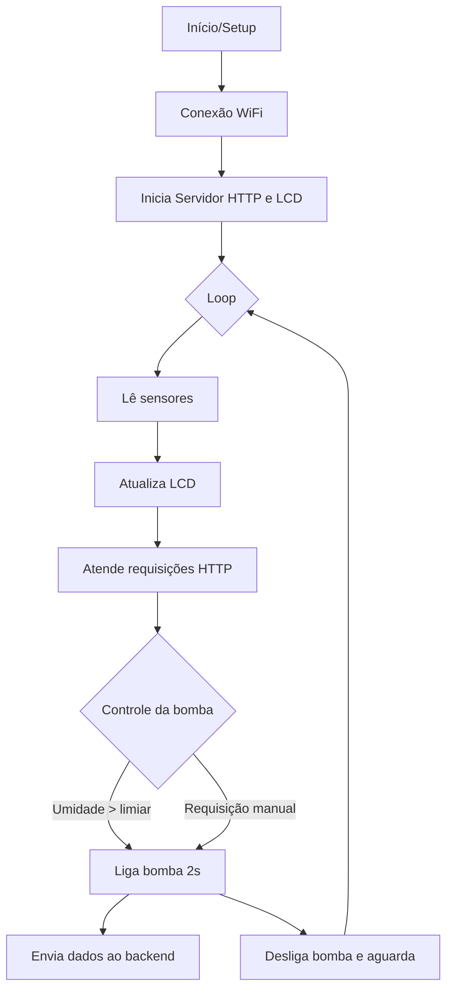

# Documentação das Funcionalidades do Sistema ESP32

Este documento descreve todas as funcionalidades embarcadas implementadas no projeto ESP32, detalhando sensores, atuadores, controles automáticos, comunicação, exibição de dados e integração com backend.

## 1. Sensores e Atuadores

### Sensores Utilizados

- **Sensor de Umidade do Solo**
    - **Pino:** 34 (ADC)
    - **Função:** Mede o nível de umidade do solo, valor analógico de 0 a 4095 (12 bits).
- **Sensor de Luminosidade (LDR)**
    - **Pino:** 33 (ADC)
    - **Função:** Mede a intensidade de luz ambiente, valor analógico de 0 a 4095.


### Atuador

- **Relé para Bomba**
    - **Pino:** 23 (Digital)
    - **Função:** Aciona/desliga a bomba de irrigação conforme lógica automática ou comando manual.


## 2. Controle Automático da Bomba

- **Acionamento Automático:**
A bomba é ligada por 2 segundos sempre que o valor de umidade do solo ultrapassa o limiar configurado (`umidade_limiar`). Após o acionamento, aguarda 15 segundos antes de permitir nova ativação automática.
- **Acionamento Manual Imediato:**
Via requisição HTTP, é possível forçar o acionamento da bomba por 2 segundos, independentemente do valor do sensor, com controle de concorrência para evitar sobreposição de comandos.
- **Proteção de Ciclo:**
Impede que a bomba seja acionada novamente antes do tempo mínimo de espera.


## 3. Comunicação WiFi

- **Configuração WiFi:**
O ESP32 conecta-se à rede WiFi definida por `ssid` e `password`. O endereço IP é exibido no display LCD ao iniciar.
- **Reconexão Automática:**
O sistema tenta conectar até 40 vezes antes de abortar e exibir erro no console serial.


## 4. Servidor HTTP Integrado

- **Porta:** 80
- **Rotas Disponíveis:**
    - `/status`
    - `/set_umidade`
    - `/restart`
    - `/ativar_bomba`

Consulte a documentação de rotas HTTP para detalhes de uso, parâmetros e exemplos.

## 5. Envio de Dados para Backend

- **Endpoint:** Definido em `backend_url` (exemplo: Webhook.site)
- **Quando Envia:**
    - Sempre que a bomba é ativada (automática ou manualmente)
- **Formato:**
Envia um JSON via POST contendo:

```json
{
  "umidade": <valor>,
  "ldr": <valor>,
  "evento": "bomba_ativada"
}
```

- **Tratamento de Falhas:**
Se o WiFi estiver desconectado, os dados não são enviados e o evento é registrado via Serial.


## 6. Exibição em Display LCD

- **Hardware:** LCD I2C 16x2, endereço 0x27
- **Informações exibidas:**
    - Linha 1: Endereço IP do ESP32 na rede
    - Linha 2: Últimos valores lidos de umidade e luminosidade (`U:<umidade> L:<ldr>`)
- **Atualização:**
A cada ciclo de leitura dos sensores (intervalo de 1 segundo).


## 7. Lógica de Controle e Fluxo do Sistema

### Setup

- Inicializa Serial, pinos, LCD, WiFi e servidor HTTP.
- Exibe mensagem de inicialização e, após conexão, mostra o IP e placeholders de sensores.


### Loop Principal

- Atende requisições HTTP.
- A cada segundo:
    - Lê sensores de umidade e luminosidade.
    - Atualiza display LCD.
    - Avalia lógica de controle da bomba (automático/manual).
    - Registra eventos no Serial.


## 8. Segurança

- **Atualmente, não há autenticação nas rotas HTTP.**
- **Recomendação:** Implementar autenticação por token ou senha para rotas sensíveis como `/restart` e `/ativar_bomba`.


## 9. Resumo das Funcionalidades

| Função | Descrição |
| :-- | :-- |
| Leitura de sensores | Umidade do solo e luminosidade ambiente |
| Controle automático da bomba | Acionamento conforme limiar e temporização |
| Acionamento manual remoto | Via rota HTTP, com controle de concorrência |
| Exibição em LCD | IP, umidade e luminosidade em tempo real |
| Envio de eventos ao backend | Notificação via HTTP POST sempre que a bomba é ativada |
| Interface HTTP | Rotas para status, configuração, reinício e acionamento da bomba |
| Log serial | Todos os eventos relevantes são registrados para depuração e auditoria |

## 10. Fluxograma Simplificado




## 11. Possíveis Expansões

- Autenticação HTTP.
- Configuração dinâmica de tempos de ciclo.
- Persistência de limiar em EEPROM.
- Integração com MQTT ou serviços em nuvem.
- Atualização OTA do firmware.

Esta documentação serve como referência para desenvolvedores, integradores e usuários do sistema embarcado ESP32 deste projeto.

